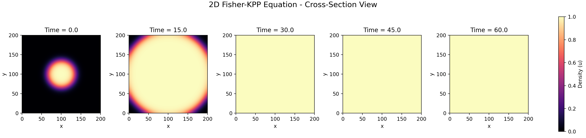

# Fisher-KPP RK4

This repository solves the 1D Fisher-KPP equation

$$
u_t = D u_{xx} + r u(1-u)
$$

using Method of Lines, second-order central finite differences in space, and classical RK4 in time.

## Project Structure

- `src/fisher_kpp_rk4/config.py`: PDE, domain, grid, time, initial condition, and boundary condition settings.
- `src/fisher_kpp_rk4/solver.py`: RHS, RK4 step, solver, stability check, front position, and error utilities.
- `scripts/run_demo.py`: executable script for the main simulation.
- `scripts/run_convergence.py`: compact convergence sanity check.
- `scripts/run_cross_section_view.py`: 2D Fisher-KPP visual check in the cross-section panel style.
- `notebooks/fisher_kpp_rk4_demo.ipynb`: notebook version of the demo.
- `assets/cross_section_view.png`: sample cross-section panel output.
- `requirements.txt`: minimal runtime and demo dependencies.
- `pyproject.toml`: installable package metadata.

## Run as Python Script

```bash
cd fisher-kpp-rk4
pip install -r requirements.txt
python scripts/run_demo.py
```

Results are saved under `outputs/`:

- `fisher_kpp_rk4_results.npz`
- `snapshots.png`
- `front_position.png`

## Cross-Section Style View

To generate a visual check like a multi-time cross-section panel:

```bash
python scripts/run_cross_section_view.py
```

This writes `outputs/cross_section_view.png`.



## Run as Notebook

Open `notebooks/fisher_kpp_rk4_demo.ipynb` in Jupyter or VS Code and run cells sequentially.

## Optional Convergence Check

```bash
python scripts/run_convergence.py
```

This writes `outputs/convergence_summary.csv`.

## Install as a Package

```bash
pip install -e .[demo]
```

## Notes

- `tol` and `max_iter` are kept in `src/fisher_kpp_rk4/config.py` only for compatibility with implicit solvers. Classical RK4 is explicit, so no nonlinear iteration is used.
- With the default setup, `dx = 0.5` and `dt = 0.01`, which is inside the practical 1D RK4 diffusion stability estimate.
- The chosen initial condition has a shallow exponential tail, so the measured front speed can exceed the minimal KPP speed `2*sqrt(D*r)`. The demo estimates speed before right-boundary interaction.
